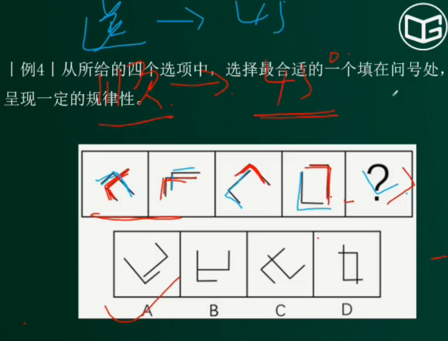
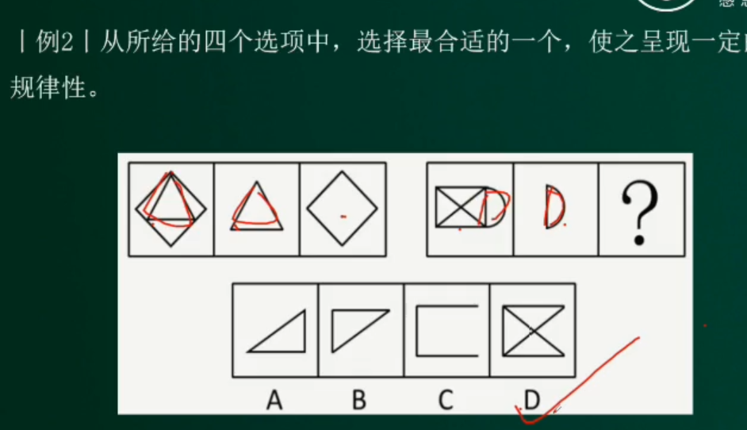
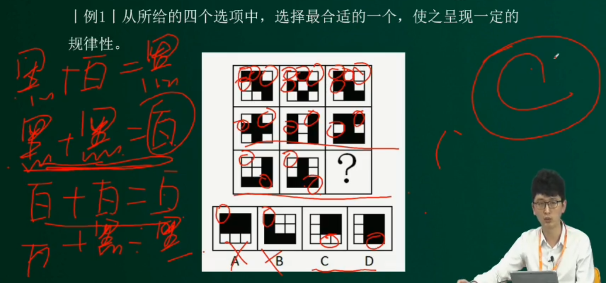
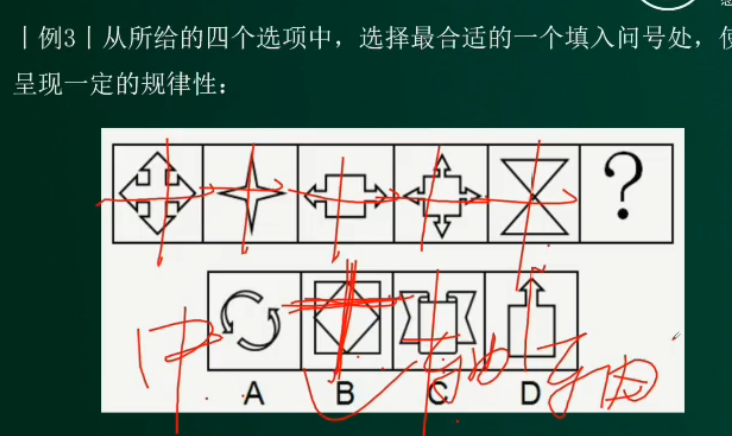

**行政职业能力测试**

- **作者：** Nicolas·Lemon
- **修改：** Nicolas·Lemon
- **创建日期：** 2023.02.24
- **修改日期：** 2023.03.13

# 判断推理

* [note-scan.pdf](./res/note-scan.pdf)

## 图形推理

### 出题形式

### 做题思路

### 位置规律

#### 平移

#### 旋转&翻转

### 样式规律

#### 图形遍历

#### 加减同异

#### 黑白运算

### 属性规律

 

#### 对称性

* 轴对称图形
  
  

* 中心对称图形
  
  

* 既是轴对称又是中心对称图形
  
  

#### 曲直性

#### 封闭性

### 数量规律

#### 数点

#### 数线

# 资料分析

## 公式技巧

### 重点概念

#### 增长

